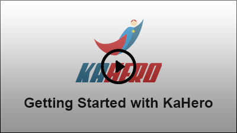

# **Introduction**

KaHero is a POS system that aims to assist businesses in their
daily operations and make transactions with your customers an easy
and quick process. We want to help in easing your troubles and with
that, we made KaHero POS to assist you.

Do you want to make your daily business transactions a quick
and easy process? KaHero POS is the ultimate business hero! Sell
your products, manage your sales, track your employee‟s shifts and
keep a record of their transactions; all of these made easier with the
help of KaHero POS.

Simply add your products and segregate them according to their
categories. Add discount lists that will be applied to your products.
Taxes can also be included in your products. With all that listed, you
can now make transactions through KaHero's mobile cash register.
Keep track of your sales and refunds through electronic receipts.
