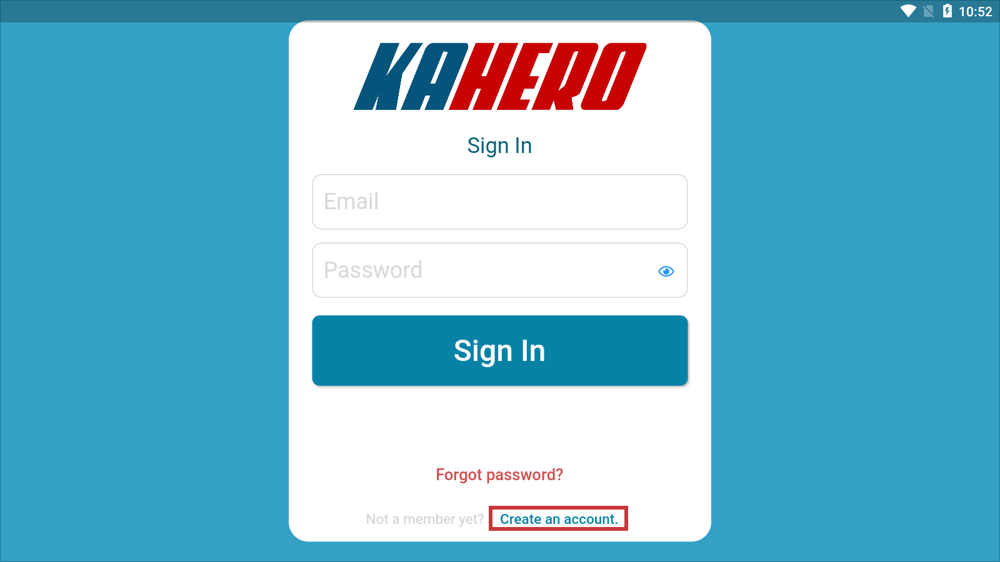
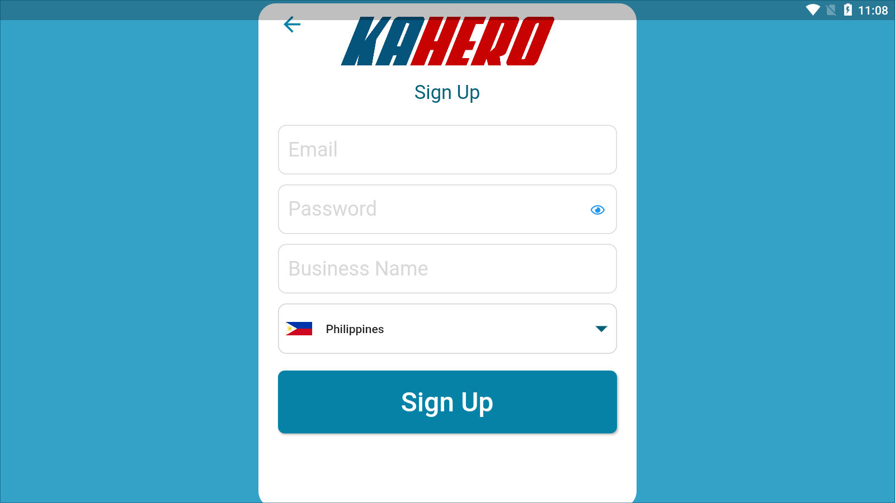
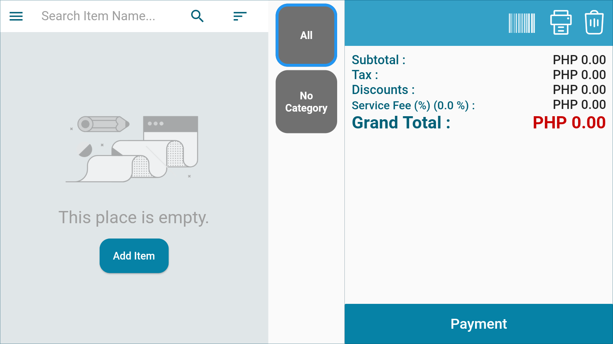

# **Getting Started**

Download and install KaHero from the Play Store (Android) or App Store (iOS).
To use KaHero POS, you'll need to have at least Android 4.2+ or iOS 9.0+.

   1. Opening KaHero for the first time will lead you to the <i>sign in screen</i>.  If you are a new user, click <b>"Create an Account"</b> to register.

  

   2. Create your account. Input your email, password, business name,  and country of choice. Click <b>Sign Up</b> to proceed.

  

   3. Your account is now created! You will be immediately   sent to the <i>register screen</i> and you can begin setting up your POS.

  