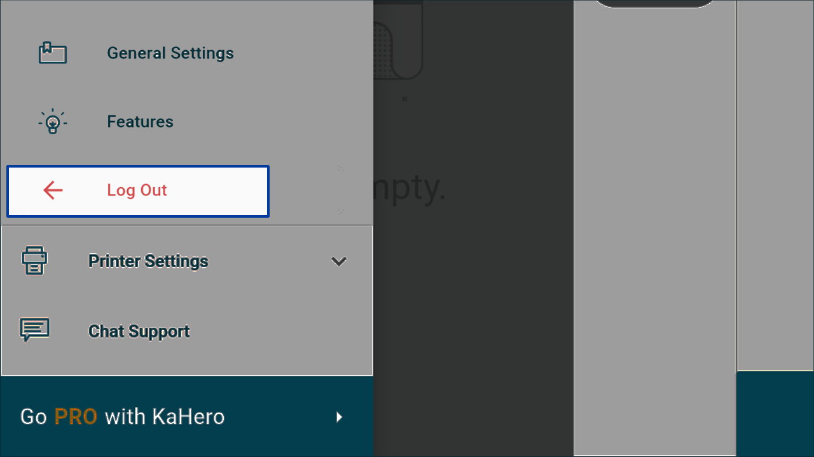

# **Getting Started**

<video width="650" height="366" controls>
  <source src="/_content/1gettingstarted.mp4" type="video/mp4">
</video>

Download and install KaHero from the Play Store (Android) or App Store (iOS).
To use KaHero POS, you'll need to have at least Android 4.2+ or iOS 9.0+.

   1. Opening KaHero for the first time will lead you to the <i>sign in screen</i>. If you are a new user, click <b>"Create an Account"</b> to register.

   

   2. Create your account. Input your email, password, business name, and country of choice. Click <b>Sign Up</b> to proceed.

    

   3. Your account is now created! You will be immediately sent to the <i>register screen</i> and you can begin setting up your POS.

    

   4. To log out of your account, go to the <b>Navigation Menu</b> and then under <b>Settings</b>, select <b>Log Out</b>.

    