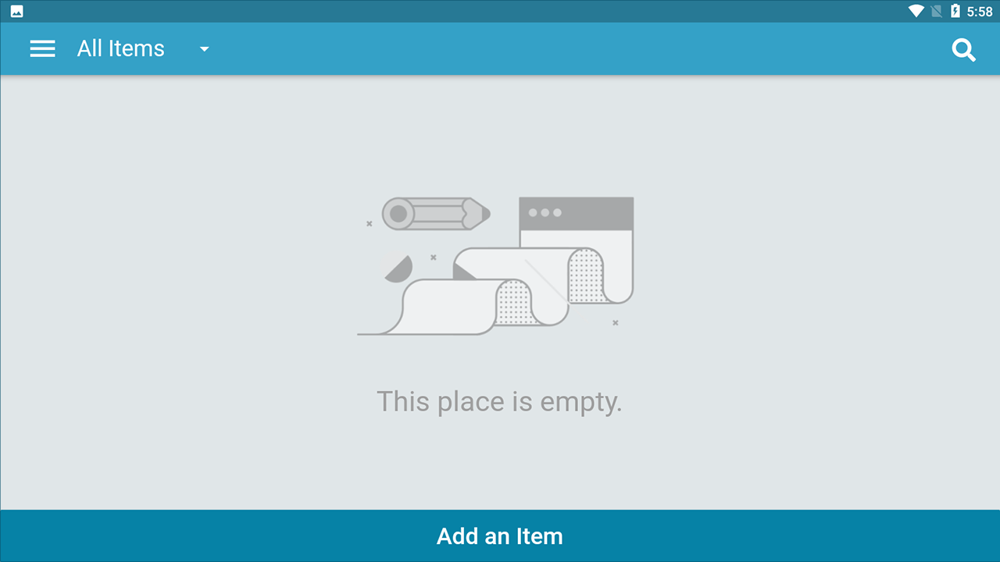
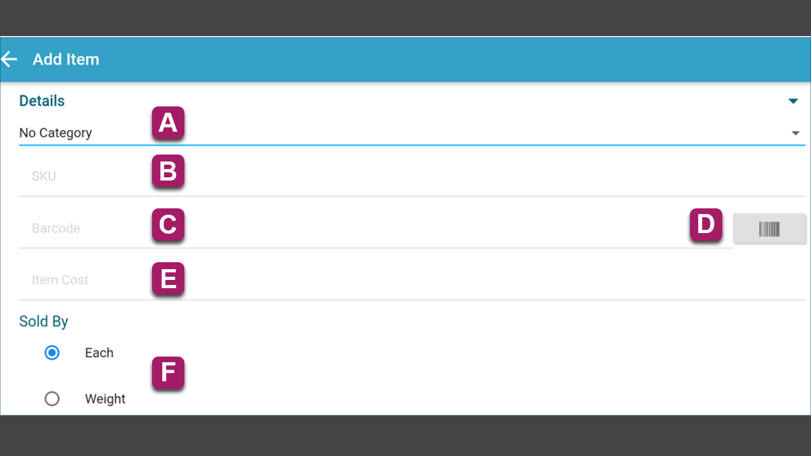
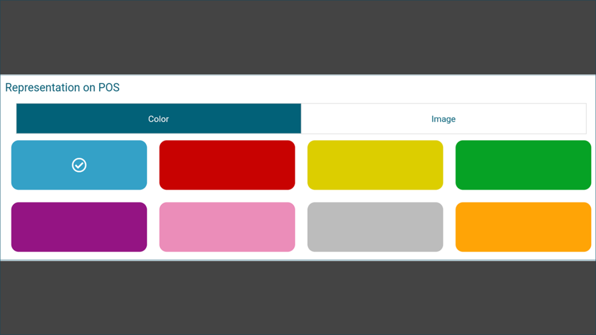
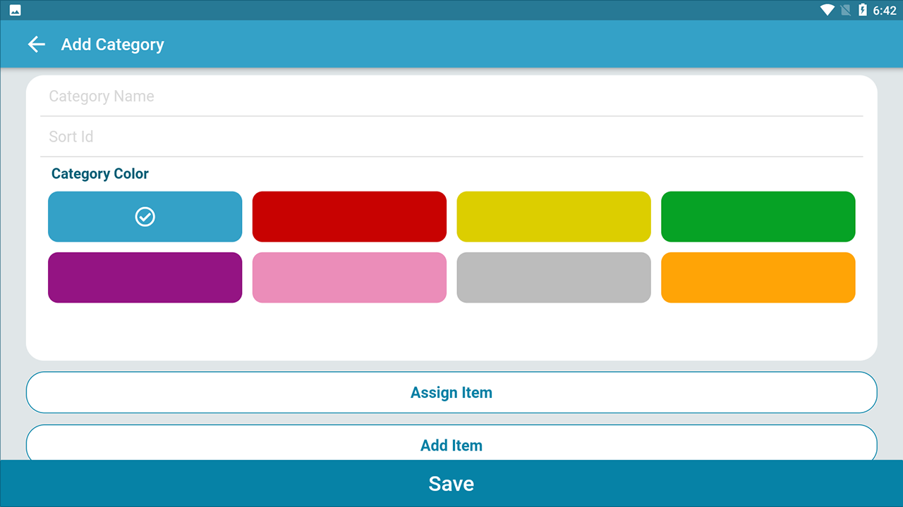

# **Adding Items and Categories in KaHero POS**

## **Adding Items**

Items are an important factor in businesses. Adding items to your account is quite easy and quick in KaHero POS.

   1. After logging in, on your current screen, click on the <b>Navigation Menu</b> button.

  

   2. Under <b>Listings</b>, Select <b>Items</b>.

   

   3. Click <b>Add an Item</b>.

   

   4. On the Add Item screen, you can input your item's details.

   

   5. Under the details section, assign a category for your item. Set your item's SKU, barcode, and item cost.

  

   6. On the bottom of the screen, you can assign a color or image to your item that will be displayed on the register.

  

## **Adding Categories**

It is important to be systematic when running a business. It is easier for you to keep track of your items when you categorize them. Adding and assigning categories to your items is easy and quick with KaHero POS.

   1. Under <b>Listings</b>, Select <b>Categories</b>.

   

   2. Click <b>Add a Category</b>.

   

   3. Input your category details. Assign a color to your category.

   

> You can now start using the register and make your sales!