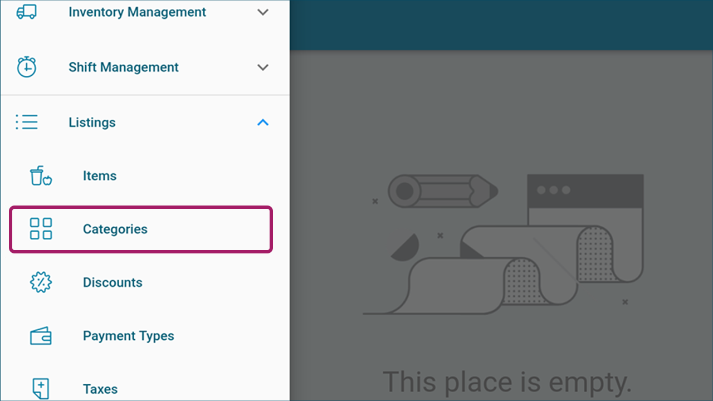

# **Adding Items and Categories in KaHero POS**

## **Adding Items**

Items are an important factor in businesses. Adding items to your account is quite easy and quick in KaHero POS.

   1. After logging in, on your current screen, click on the <b>Navigation Menu</b> button.

    

   2. Under <b>Listings</b>, Select <b>Items</b>.

     

   3. Click <b>Add an Item</b>.

     

 4. On the Add Item screen, you can input your item's details.
<h5><ol type="a" style="float:left; margin-left:1rem">
<li><b>Item Name</b> - set item's name to display on the register</li>
<li><b>Item Price</b> - set item's price to display on the register</li>
<li><b>Warehouse</b> - set item's storage location</li>
<li><b>Beginning Qty</b> - set beginning item quantity upon input on the POS</li>
<li><b>Sale Item</b> - enable or disable item as a sales item or just a stock item</li>
</ol></i></h5>

       

<h5><ol type="a" style="float:left; margin-left:1rem">
<li><b>Category</b> - select a category to assign your item to</li>
<li><b>SKU</b> - set item's Stock Keeping Unit to identify that item</li>
<li><b>Barcode</b> - manually input barcode of the item</li>
<li><b>Barcode Scan icon</b> - allows you to use a scanner device to scan the  code of an item</li>
<li><b>Item Cost</b> - input cost of item upon purchase for stock</li>
<li><b>Sold By</b> - set whether your item is to be sold by individually or by weight</li>
</ol></h5>

          

   6a. Assign a representation color to your item. This is how it will be displayed on your register screen.

    

   6b. Upload an image to represent your item. This is how it will be displayed on your register screen.

    

## **Adding Categories**

It is important to be systematic when running a business. It is easier for you to keep track of your items when you categorize them. Adding and assigning categories to your items is easy and quick with KaHero POS.

   1. Under <b>Listings</b>, Select <b>Categories</b>.

     

    2. Click <b>Add a Category</b>.

    

 3. Input your category details.<h5><ol type="a" style="float:left; margin-left:1rem">
<li><b>Category Name</b> - label your category</li>
<li><b>Sort ID</b> - set your category ID for sorting with "1" as the highest. This is useful to quickly sort your categories according to which items are best-sellers.</li>
<li>Assign a color for your category.</li>
<li>Click <b>Assign Item</b> to select which items to include in this category.</li>
</ol></h5>

       

    4. Select the items you want to include in the category.

    

> You can now start using the register and make your sales!