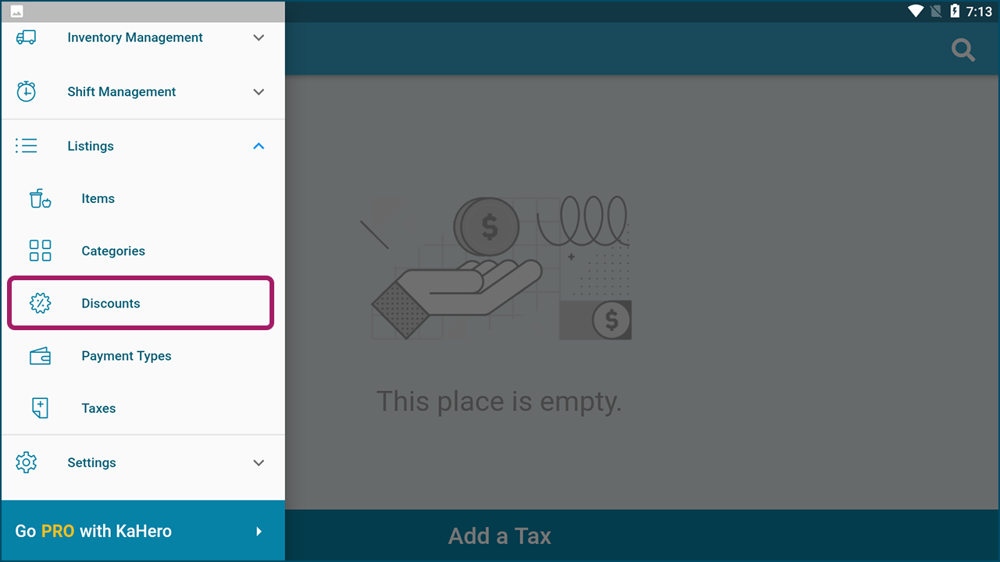

# **Creating and Configuring Discounts**

KaHero POS allows you to add discounts to your items and sales.

   1. Under <b>Listings</b>, select <b>Discounts</b>.

   

   2. Click <b>Add a Discount</b>.

   

   
3. Input your discount name, discount value, and whether the value is <b>By Percentage</b> or <b>By Whole Number</b>.

  

> Click <b>Save</b> and you can now apply discounts to your sales.