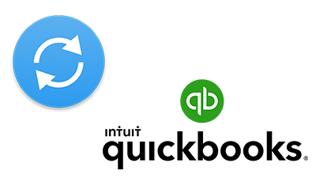

# **FEATURES**

### A. OFFLINE POS

> KaHero POS works online and offline. Transactions can be
made even if you are offline. But it is necessary to be connected to
the internet when logging in to your account for the first time.

### B. QUICKBOOKS SYNCHRONIZATION

> KaHero POS works with Quickbooks Online to synchronize
your sales data every shift. Every time you end a shift, Quickbooks
generates a sales receipt with the list of items, discounts, refunds,
cash ins and cash outs, making it easier for you to keep track of
your accounts.

### C. SALES ANALYTICS

> KaHero POS is partnered with KaHero Analytics that tracks
your daily sales and generates sales reports and analytics.

### D. SHIFT MANAGEMENT

> KaHero POS lets you manage your shifts between your
employees and track each of their shift hours and sales
transactions.

### E. BIR REGISTERED

> KaHero POS is registered to the Bureau of Internal
Revenues. BIR accreditation is an essential regulation. KaHero
POS will assist you with that.