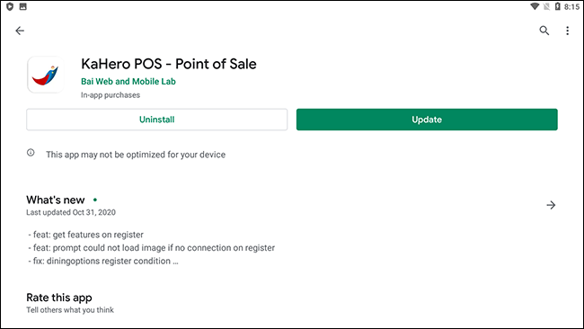
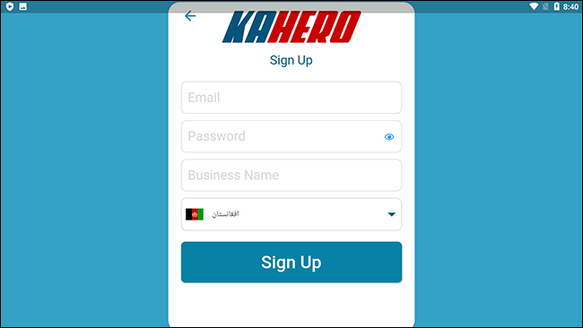

# **Initial Steps**

<h4>1. DOWNLOAD AND INSTALL KAHERO POS FROM GOOGLE PLAYSTORE</h4>

<strong>Minimum requirements:</strong>
* Android 5 – Lollipop
* 8” – 10” Tablet
* Internet connection (for data synchronization)

<h4>2. SIGN-UP AND CREATE A KAHERO POS ACCOUNT WITH INTERNET CONNECTION</h4>

For first time users, create your first KaHero POS account.

<h4>3. SET-UP YOUR POS ACCOUNT</h4>

You can now enter your business's data (products, categories,
taxes, etc.) to complete the initial process before making use of
KaHero's features.

<h4> WORKING WITH KAHERO POS</h4>

After logging in to your KaHero POS account, you will be
directed to the mobile cash register screen. On the upper left beside
the search item name bar, you will see a burger icon which will lead
you to the navigation bar. Under 'settings’, you can find ‘features’
where you can choose which of the app's features you want to make
use of.