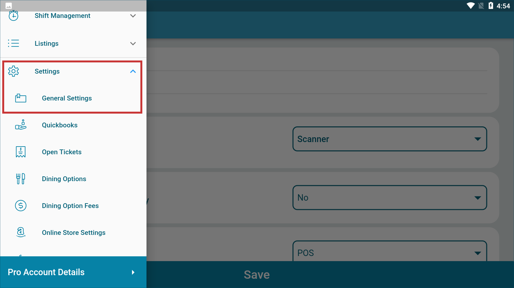
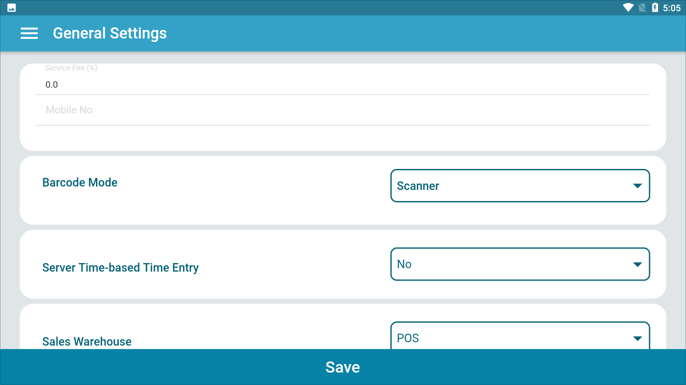
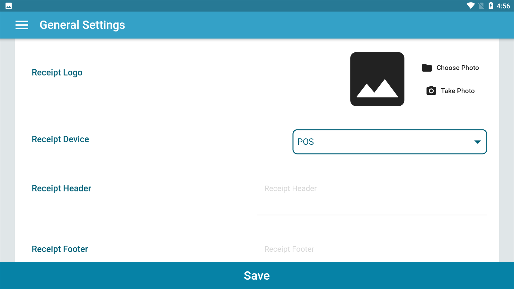
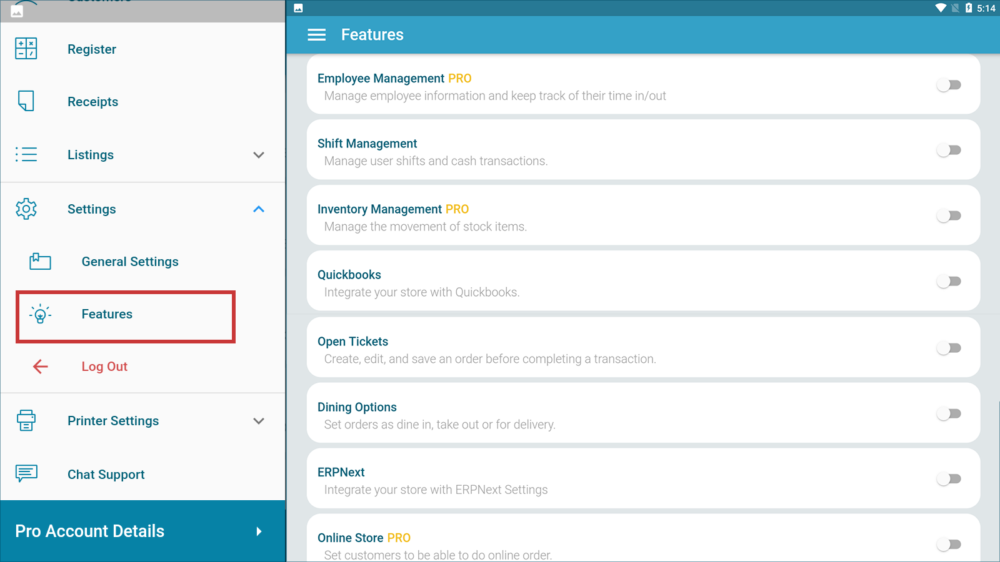

# **Setting Up Your Business in KaHero POS**

Once you have installed KaHero POS on your device, setting up you business settings is the next step.

   1. On the <b>Navigation Menu</b> under <b>Settings</b>, select <b>General Settings</b>. Fill in your business details on this screen.

  

   2. Set up your business details on this screen. Set up your service fee and your business's mobile number. Set your business's barcode mode if you are going to use barcode scanners.

 

   3. Under <b>General Settings</b>, you can find the receipt settings.

   

> Once you are done setting up your business details, click <b>Save</b>.

   4. On the <b>Navigation Menu</b> under <b>Settings</b>, select <b>Features</b>. Here, you can find which features you want to activate. Some features are only available on the PRO version.

 

> Once you are done activating features, click <b>Save</b>.