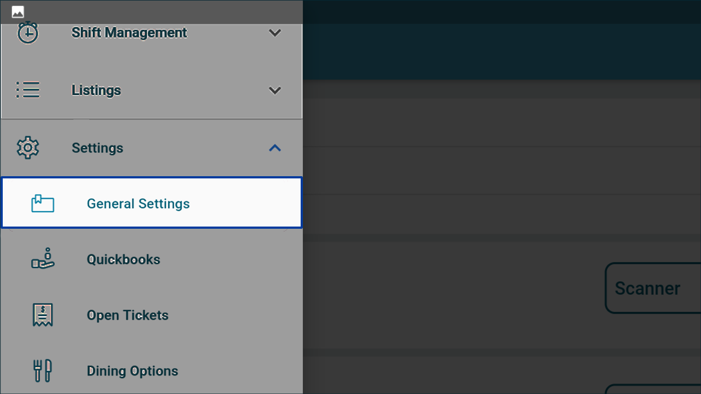
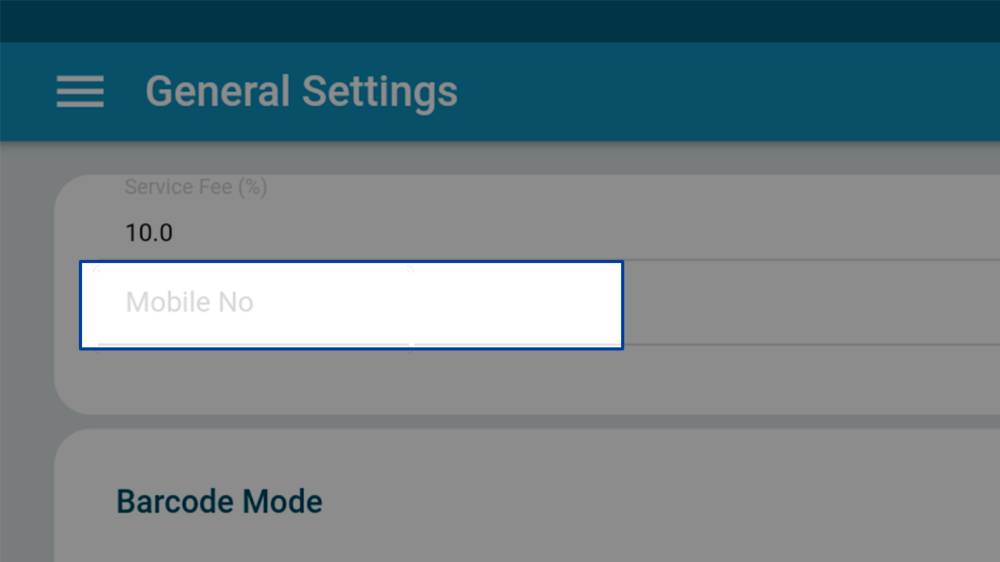
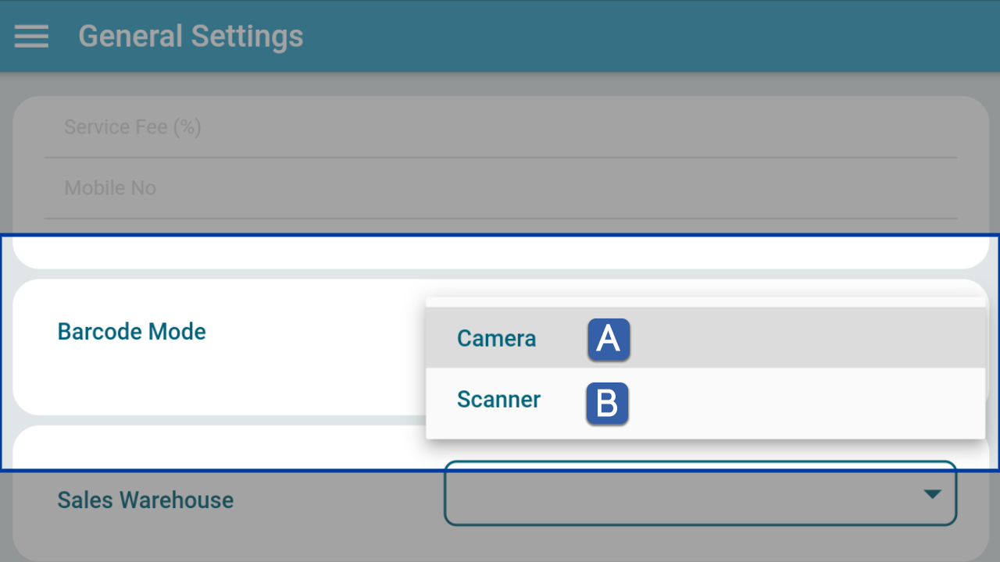
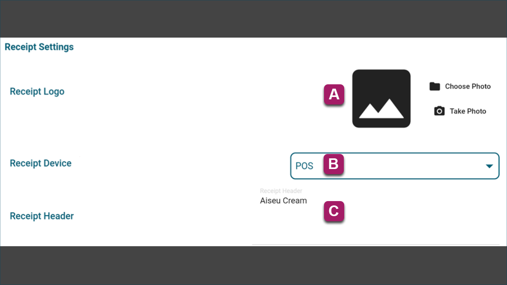
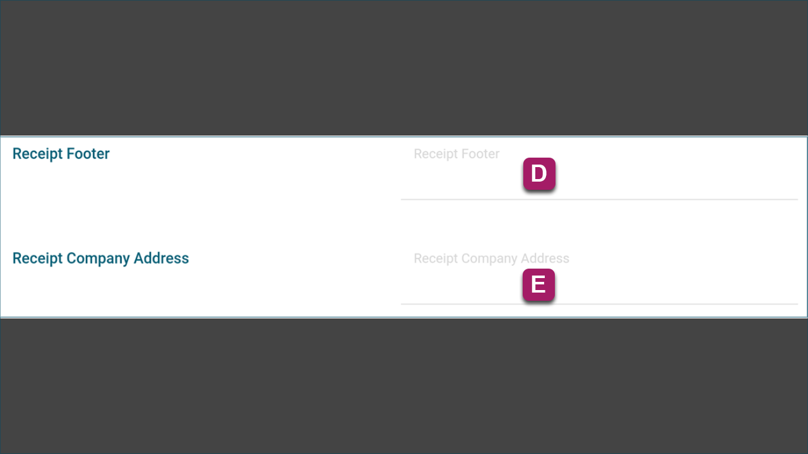
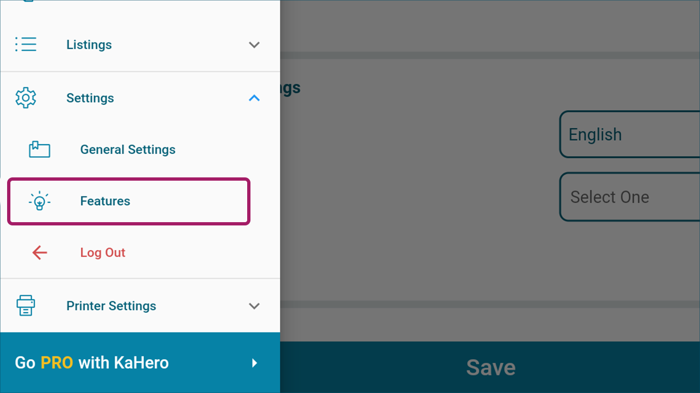

# **Setting Up Your Business in KaHero POS**

Once you have installed KaHero POS on your device, setting up your business settings is the next step.

## **General Settings**

   1. On the <b>Navigation Menu</b> under <b>Settings</b>, select <b>General Settings</b>.

    

   2. Set up you store's <b>Service Fee</b> (in percentage). This will reflect on your transactions on the <b>Register</b> screen. A percentage of your customer's total amount will be added to the grand total.

   

   3. Add your business's mobile number. This is useful when you have set up an online store or you have registered to KaHero's PRO version. KaHero POS will send notifications to your mobile number.

  

  4. If you have a scanning device, set up your store's <b>Barcode Mode</b>.
<h5>
<ul style="float:left; margin-left:1rem">
<li><b>Camera</b> - built-in camera of mobile devices</li>
<li><b>Scanner</b> - barcode reader device</li>
</ul>
</h5>

     

   5. Choose which country your business is located and it will automatically suggest your currency for you.

    

   6. Set your preferred language settings and timezone location.

     

  7. With KaHero POS, you are able to print receipts. Set up your <b>Receipt Settings</b>.
<h5>
<ol type="a" style="float:left; margin-left:1rem">
<li><b>Receipt Logo</b> - upload a photo that you want to appear on your receipt</li>
<li><b>Receipt Device</b> - assign mobile device that you will use to generate sales receipt</li>
<li><b>Receipt Header</b> - input your receipt header text</li>
</ol>
</h5>

     

  
<h5>
<ol start="4" type="a" style="float:left; margin-left:1rem">
<li><b>Receipt Footer</b> - input your receipt footer text</li>
<li><b>Receipt Company Address</b> - input your company address</li>
</ol>
</h5>

       

> Once you are done setting up your business details, click <i>Save</i>.

## **Activating Features**

    9. On the <b>Navigation Menu</b> under <b>Settings</b>, select <b>Features</b>.

    

    Here, you can find which features you want to activate. Some features are only available on the PRO version.

   
> Once you are done activating features, click <i>Save</i>.