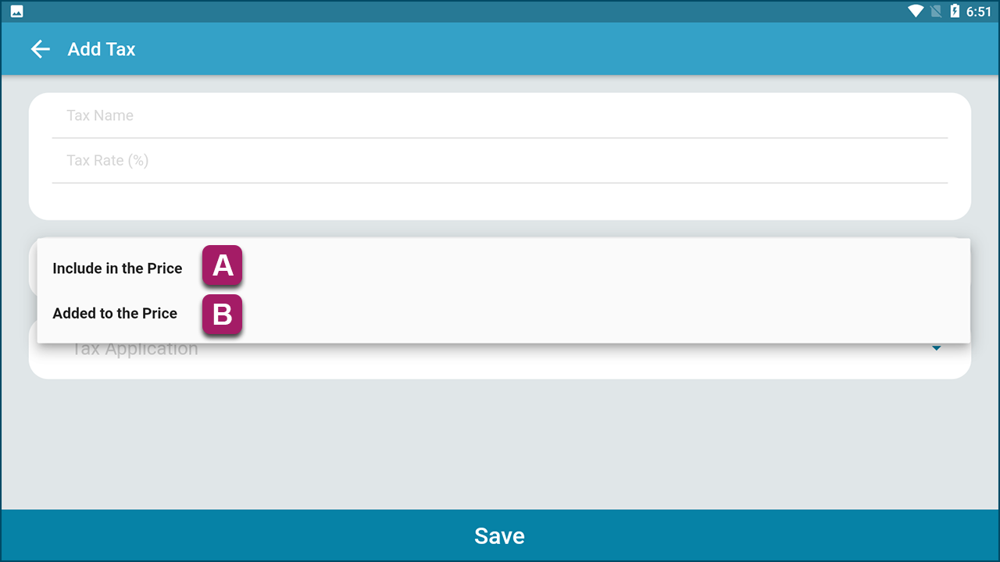
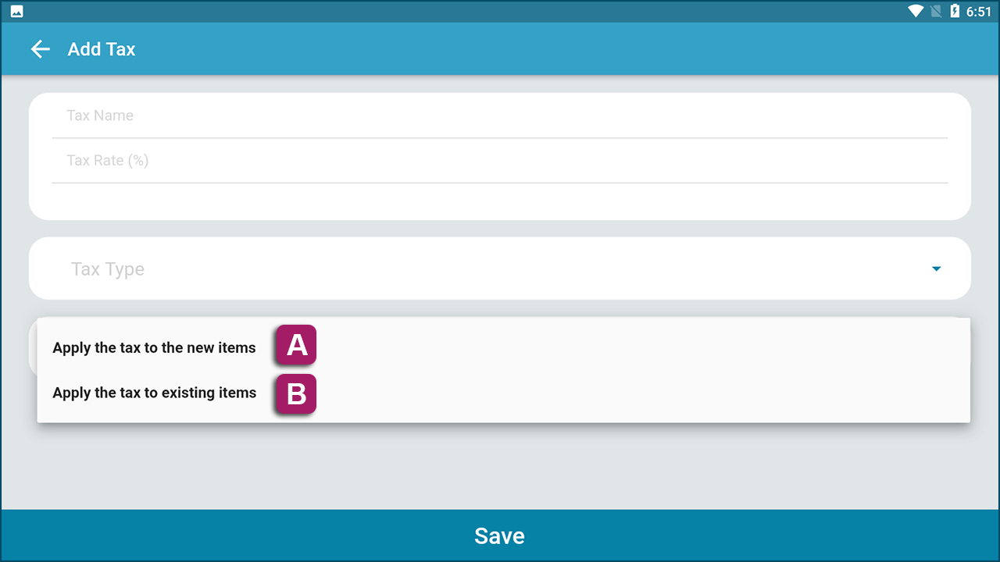

# **Configuring Taxes**

KaHero POS allows you to add taxes to your items.

   1. Under <b>Listings</b>, select <b>Taxes</b>.

   

   2. Click <b>Add a Tax</b>.

   

   3. Input your tax name and tax rate (in percent).

   

  4. Select your Tax Type. <b>"Included in the Price"</b> means your tax is already included in the price you have set on your item. There will be no changes to your price on any transaction. <b>"Added to the Price"</b> means your tax will be added to your pricing and changes to your pricing will reflect on transaction tickets.

 

  5. Select your Tax Application. <b>"Apply the tax to the new items"</b> means this tax will applicable to newly added items after the creation of the tax. <b>"Apply the tax to existing items"</b> means the tax will be applied to items already input before the creation of the tax.

 

>Click <b>Save</b> and your taxes will now be applied to your items.