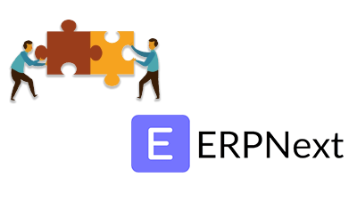

# **FEATURES**

### OFFLINE POS

> KaHero POS works online and offline. Transactions can be
made even if you are offline. But it is necessary to be connected to
the internet when logging in to your account for the first time.

### EMPLOYEE MANAGEMENT

> KaHero POS helps you manage your employee's work information
and lets you keep track of their shifts.

### SHIFT MANAGEMENT

> KaHero POS lets you manage the shifts between your
employees and track their working time and sales
transactions.

### INVENTORY MANAGEMENT

> KaHero POS allows you to manage your inventory and the movement of
your stock items.

### QUICKBOOKS SYNCHRONIZATION

> KaHero POS works with Quickbooks Online to synchronize
your sales data every shift. Every time you end a shift, Quickbooks
generates a sales receipt with the list of items, discounts, refunds,
cash ins and cash outs, making it easier for you to keep track of
your accounts.

### PRINT GROUP ORDER

> KaHero POS allows you to send orders to a group of printers.

### OPEN TICKETS

> KaHero POS allows you to create, edit, and save an order before
making it a complete transactions.

### PREDEFINED TICKETS

> With the Predefined Tickets feature enabled, KaHero POS allows you
to quickly assign names to your open tickets.

### DINING OPTIONS

> With Dining Options enabled, KaHero POS allows you to set orders for
dine in, take out, or delivery

### ERPNext

> You can also integrate your settings with the ERPNext settings.

### ONLINE STORE

> KaHero POS allows your customers to order from your site
online.

### PARTIAL PAYMENT

> The Partial Payment allows your customers to pay for the
total amount partially.

### BIR REGISTERED

> KaHero POS is registered to the Bureau of Internal
Revenues. BIR accreditation is an essential regulation. KaHero
POS will assist you with that.

### SALES ANALYTICS

> KaHero POS is partnered with KaHero Analytics that tracks
your daily sales and generates sales reports and analytics.